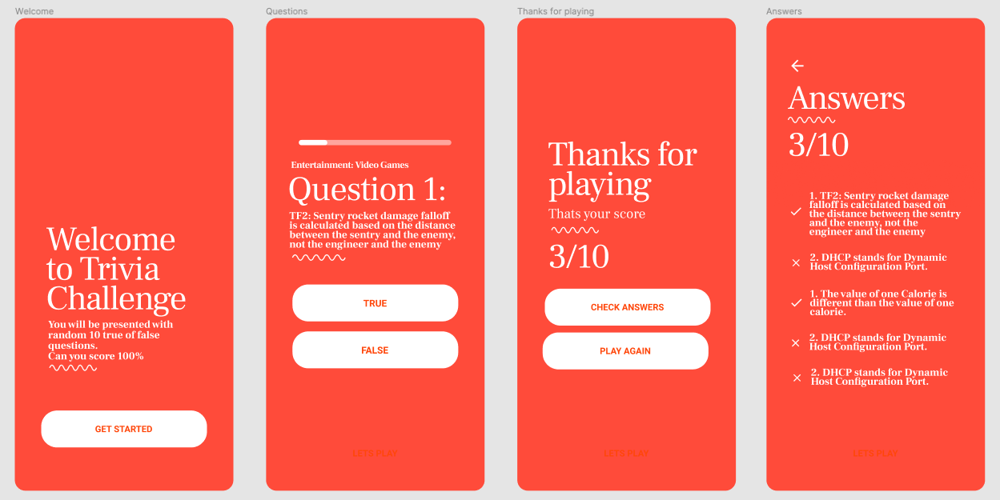

# Challenge React Native

# What to do

### API

Thats the api that will be used:
https://opentdb.com/api.php?amount=10&difficulty=hard&type=boolean

### App

The idea is to do an trivia app with 4 screens

- Welcome: the user clicks the get started button to start playing
- Questions: the user answer the questions with true of false
- Thanks For Playing: shows all the user score and two buttons one for playing again and one to check the answers
- Check answers: shows all the questions that he missed and the ones that he got rightt

# Requirements

Use React Native with styled-components, react-navigation, axios and any global state management library like Context, Redux or Mobx

# Questions

Any questions send me a message on React Brasil my user is LFSCamargo

https://react-brasil.github.io/react-brasil-slack/
